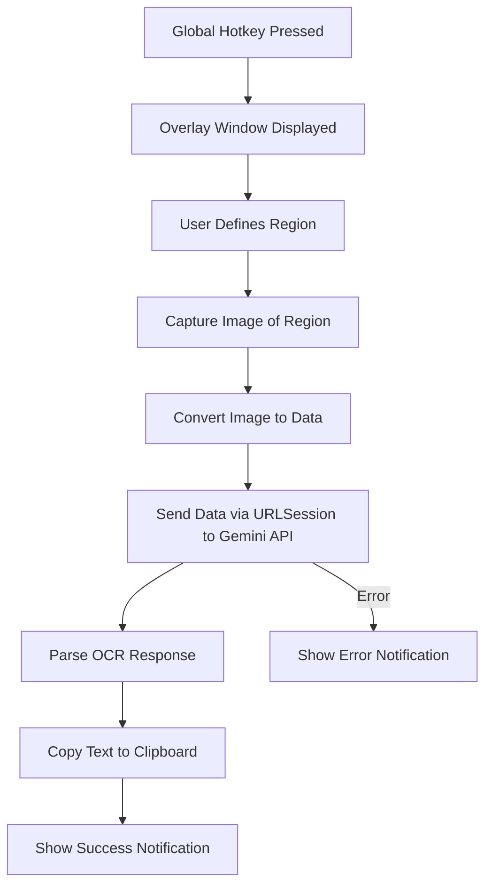

# Product Requirements Document (PRD) and Implementation Plan

## 1. Overview

This project is a native macOS application built in Swift that replaces the standard screenshot behavior with a specialized tool. When activated (using a custom global hotkey), the app will let the user select a region on the screen, capture an image of that region, send the image to the Gemini 2.0flash OCR API, and then retrieve a text output (formatted in Markdown or LaTeX as applicable) that is automatically copied to the system clipboard. The goal is to create a fast, lightweight, and intuitive tool that integrates deeply with macOS functionalities.

---

## 2. Objectives

- **Primary Objective:**  
  Build a high-performance macOS app that captures a user-selected region, performs OCR via an external API, and dumps the resulting text (in Markdown format) to the clipboard.

- **Secondary Objectives:**
  - Ensure the app is extremely fast and responsive.
  - Leverage native macOS APIs for a seamless user experience.
  - Provide a minimal and unobtrusive user interface.
  - Implement robust error handling and user notifications.

---

## 3. User Stories

- **As a user**, I want to press a custom hotkey (e.g., Ctrl+Shift+9) so that I can quickly capture a region of my screen.
- **As a user**, I want to select a portion of the screen and have the tool automatically capture that area.
- **As a user**, I want the app to send the captured image to the Gemini 2.0flash OCR API so that I can get the text version of the image.
- **As a user**, I want the OCR text to be formatted in Markdown (and, where applicable, include LaTeX formatting) and automatically placed into my clipboard.
- **As a user**, I want feedback (notifications or alerts) when the process succeeds or fails.

---

## 4. Functional Requirements

1. **Global Hotkey Registration:**
   - **Requirement:** The app must register and listen for a custom global hotkey (e.g., Ctrl+Shift+9) that does not conflict with existing system shortcuts.
   - **Implementation Detail:** Use macOS APIs (such as `NSEvent` global monitors or an event tap) to capture key events.

2. **Region-Based Screenshot Capture:**
   - **Requirement:** Allow the user to define a region on the screen.
   - **Implementation Detail:** Create a transparent overlay window where the user can click and drag to define the region.
   - **API Reference:** Use Core Graphics (`CGWindowListCreateImage`) for capturing the defined screen region.

3. **OCR Integration:**
   - **Requirement:** Send the captured image to the Gemini 2.0flash OCR API.
   - **Implementation Detail:**  
     - Convert the `NSImage` into an appropriate data format (PNG or JPEG).
     - Build a POST request using `URLSession` that includes the image data.
     - Parse the JSON response to extract the OCR’d text.
   - **Security:** Securely store and use the API key and other credentials.

4. **Clipboard Management:**
   - **Requirement:** Automatically copy the OCR output (Markdown-formatted text) to the system clipboard.
   - **Implementation Detail:** Use `NSPasteboard` to set the clipboard content.

5. **User Feedback and Notifications:**
   - **Requirement:** Provide immediate visual feedback for successful OCR conversion or errors.
   - **Implementation Detail:** Use either `NSUserNotificationCenter` or `UNUserNotificationCenter` for system notifications.
   - **Error Handling:** Display appropriate error messages if the OCR process or network request fails.

6. **Performance Requirements:**
   - **Requirement:** The process from hotkey press to clipboard update should be near instantaneous.
   - **Implementation Detail:** Optimize code paths and ensure asynchronous operations (e.g., networking) do not block the main thread.

---

## 5. Non-Functional Requirements

- **Responsiveness:**  
  The app should perform all tasks with minimal delay.

- **Lightweight:**  
  The app must use minimal system resources and load quickly.

- **Reliability:**  
  Robust error handling and retry mechanisms for network/API calls.

- **Security:**  
  Ensure safe handling of API keys and personal data. Follow best practices for macOS code signing and sandboxing if applicable.

- **Maintainability:**  
  Code should be modular and well-documented, with clear separation of concerns (e.g., hotkey handling, screenshot capture, networking, and clipboard management).

- **Scalability:**  
  Although currently a single-feature app, structure the code so that future features (e.g., additional OCR providers, customization options) can be added with minimal disruption.

---

## 6. System Architecture

### 6.1 Components

1. **Hotkey Manager:**
   - Registers and monitors the global hotkey.
   - Invokes the main capture process when triggered.

2. **Screenshot Manager:**
   - Displays an overlay for region selection.
   - Captures the selected region using native APIs.
   - Converts the captured image into a transferable format.

3. **Networking Module:**
   - Constructs and sends HTTP POST requests to the Gemini 2.0flash OCR API.
   - Parses the response and extracts the OCR result.
   - Implements error and timeout handling.

4. **Clipboard Manager:**
   - Interacts with `NSPasteboard` to place the final text into the system clipboard.

5. **Notification Manager:**
   - Displays success/error notifications to the user.

### 6.2 Data Flow Diagram



---

## 7. Detailed Implementation Plan

### 7.1 Environment Setup

- **Install Xcode:**  
  Ensure you have the latest version of Xcode installed.
- **Create a New macOS Project:**  
  Use the Cocoa App template in Swift.

### 7.2 Global Hotkey Implementation

- **Objective:** Capture the custom hotkey (Ctrl+Shift+9) globally.
- **Steps:**
  1. Research and decide between `NSEvent` global monitoring or an event tap.
  2. Implement a `HotkeyManager` class:
     - Register the hotkey.
     - Listen for key events.
     - Invoke the screenshot process on detection.
- **Sample Pseudocode:**

  ```swift
  class HotkeyManager {
      init() {
          // Configure the global event monitor here.
      }
      
      func registerHotkey() {
          // Use NSEvent.addGlobalMonitorForEvents(matching: .keyDown) to detect Ctrl+Shift+9
      }
      
      private func handleKeyEvent(event: NSEvent) {
          // Check if event matches Ctrl+Shift+9 and trigger screenshot capture.
      }
  }
  ```

### 7.3 Region-Based Screenshot Capture

- **Objective:** Let the user select a screen region and capture that area.
- **Steps:**
  1. Create a transparent overlay window that covers the entire screen.
  2. Detect mouse down, drag, and mouse up events to determine the region.
  3. Draw a visual rectangle as feedback during selection.
  4. Once selection is complete, use Core Graphics to capture the defined area.
- **APIs to Use:**  
  `NSWindow`, `NSView`, `CGWindowListCreateImage`
- **Sample Pseudocode:**

  ```swift
  class ScreenshotManager {
      func presentOverlay() {
          // Create and display a borderless, transparent NSWindow
          // Add an NSView subclass to capture mouse events and draw selection rectangle
      }
      
      func captureRegion(rect: CGRect) -> NSImage? {
          // Use CGWindowListCreateImage with the rect to capture the screen region
          return NSImage(cgImage: capturedCGImage, size: rect.size)
      }
  }
  ```

### 7.4 Gemini 2.0flash OCR API Integration

- **Objective:** Send the captured image to the OCR API and retrieve formatted text.
- **Steps:**
  1. Convert the `NSImage` to a data format (e.g., PNG).
  2. Create a networking layer using `URLSession` to handle the POST request.
  3. Include necessary headers, API keys, and any required parameters.
  4. Parse the JSON response to extract the OCR result.
  5. Handle errors, such as network timeouts or invalid responses.
- **Sample Pseudocode:**

  ```swift
  class OCRService {
      let apiURL = URL(string: "https://api.gemini2.0flash.com/ocr")!
      let apiKey = "YOUR_API_KEY"
      
      func sendImageForOCR(image: NSImage, completion: @escaping (Result<String, Error>) -> Void) {
          guard let imageData = image.tiffRepresentation,
                let bitmapRep = NSBitmapImageRep(data: imageData),
                let pngData = bitmapRep.representation(using: .png, properties: [:])
          else {
              completion(.failure(OCRServiceError.imageConversionFailed))
              return
          }
          
          var request = URLRequest(url: apiURL)
          request.httpMethod = "POST"
          request.addValue("application/json", forHTTPHeaderField: "Content-Type")
          request.addValue(apiKey, forHTTPHeaderField: "Authorization")
          
          // Construct the JSON payload with base64 encoded image data (if required by API)
          let payload: [String: Any] = [
              "image_data": pngData.base64EncodedString()
          ]
          
          do {
              request.httpBody = try JSONSerialization.data(withJSONObject: payload, options: [])
          } catch {
              completion(.failure(error))
              return
          }
          
          URLSession.shared.dataTask(with: request) { data, response, error in
              if let error = error {
                  completion(.failure(error))
                  return
              }
              
              guard let data = data,
                    let jsonResponse = try? JSONSerialization.jsonObject(with: data, options: []) as? [String: Any],
                    let ocrText = jsonResponse["ocr_text"] as? String else {
                  completion(.failure(OCRServiceError.invalidResponse))
                  return
              }
              
              completion(.success(ocrText))
          }.resume()
      }
  }
  
  enum OCRServiceError: Error {
      case imageConversionFailed
      case invalidResponse
  }
  ```

### 7.5 Clipboard Management

- **Objective:** Copy the OCR result to the clipboard.
- **Steps:**
  1. Create a `ClipboardManager` class.
  2. Use `NSPasteboard.general` to write the text data.
- **Sample Pseudocode:**

  ```swift
  class ClipboardManager {
      func copyToClipboard(text: String) {
          let pasteboard = NSPasteboard.general
          pasteboard.clearContents()
          pasteboard.setString(text, forType: .string)
      }
  }
  ```

### 7.6 User Notifications and Error Handling

- **Objective:** Notify the user on success or failure.
- **Steps:**
  1. Implement a `NotificationManager` that uses `UNUserNotificationCenter`.
  2. Trigger notifications after OCR completion or on error.
- **Sample Pseudocode:**

  ```swift
  class NotificationManager {
      func showNotification(title: String, message: String) {
          let content = UNMutableNotificationContent()
          content.title = title
          content.body = message
          
          let request = UNNotificationRequest(identifier: UUID().uuidString, content: content, trigger: nil)
          UNUserNotificationCenter.current().add(request, withCompletionHandler: nil)
      }
  }
  ```

### 7.7 Integration Workflow

1. **Hotkey Trigger:**  
   When the custom hotkey is pressed, the `HotkeyManager` triggers the screenshot process.
2. **Region Selection & Capture:**  
   The `ScreenshotManager` displays the overlay. Upon region selection, it captures the image.
3. **OCR Processing:**  
   The captured image is passed to `OCRService` which sends it to the Gemini API.
4. **Clipboard Update:**  
   Once the OCR text is received, the `ClipboardManager` copies it to the clipboard.
5. **User Notification:**  
   The `NotificationManager` displays a success or error message based on the result.

---

## 8. Testing and Quality Assurance

- **Unit Testing:**  
  Write unit tests for:
  - Hotkey registration and event handling.
  - Screenshot capture logic (mocking the overlay behavior).
  - Networking code (simulate API responses).
  - Clipboard operations.

- **Integration Testing:**  
  Test the complete flow from hotkey press to clipboard update.
  
- **Performance Testing:**  
  Ensure that the entire process is fast and does not introduce significant delays.

- **Error Handling:**  
  Simulate network errors, invalid API responses, and image conversion failures to ensure robust error handling.

---

## 9. Deployment and Distribution

- **Code Signing and Notarization:**  
  Ensure the app is signed and notarized as per Apple’s guidelines.
- **Distribution Options:**
  - Distribute via the Mac App Store.
  - Alternatively, provide a downloadable signed binary from your website.
- **Documentation:**  
  Include user documentation on installation and usage, along with a README that details configuration (e.g., where to set the API key).

---

## 10. Future Enhancements

- **Customizable Hotkeys:**  
  Allow users to configure their preferred shortcut.
- **Additional OCR Providers:**  
  Support multiple OCR APIs for fallback or enhanced features.
- **UI Improvements:**  
  Provide a settings window for API key management, logging preferences, and advanced options.
- **Analytics:**  
  Integrate basic usage analytics to help understand how the tool is used.

---

## 11. Conclusion

This detailed PRD and Implementation Plan lays out the full roadmap for building a high-performance macOS screenshot OCR utility in Swift. The modular design ensures that each component (hotkey handling, region capture, OCR integration, clipboard management, and notifications) is decoupled and testable, allowing for both rapid development and easy future enhancements.

By following this plan, you (or an LLM tasked with coding) can develop the application from scratch with a clear understanding of each requirement and implementation detail.